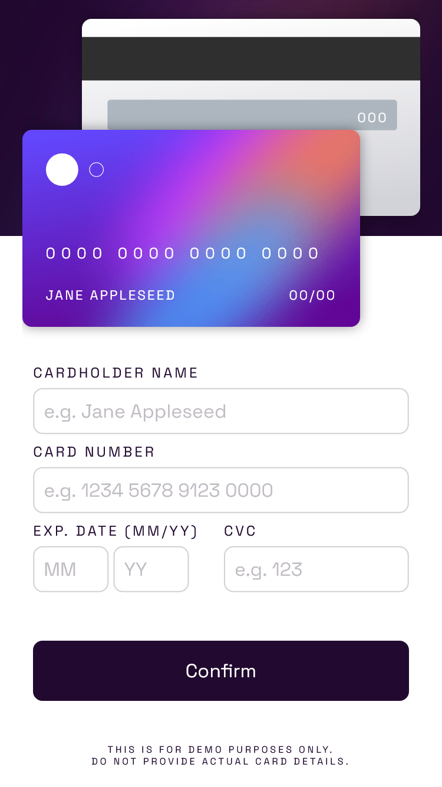

# Frontend Mentor - Interactive card details form solution

This is a solution to the [Interactive card details form challenge on Frontend Mentor](https://www.frontendmentor.io/challenges/interactive-card-details-form-XpS8cKZDWw). Frontend Mentor challenges help you improve your coding skills by building realistic projects.

## Table of contents

- [Overview](#overview)
  - [The challenge](#the-challenge)
  - [Screenshot](#screenshot)
  - [Links](#links)
- [My process](#my-process)
  - [Built with](#built-with)
  - [What I learned](#what-i-learned)
- [Author](#author)

## Overview

### The challenge

Users should be able to:

- Fill in the form and see the card details update in real-time
- Receive error messages when the form is submitted if:
  - Any input field is empty
  - The card number, expiry date, or CVC fields are in the wrong format
- View the optimal layout depending on their device's screen size
- See hover, active, and focus states for interactive elements on the page

### Screenshots


<br>

<br>



### Links

- Solution URL: [Link](https://github.com/ishraqfatin/webDev/tree/main/frontendMentor/interactiveCardInfo)
- Live Site URL: [Link](https://ishraqfatin.github.io/webDev/)

## My process

### Built with

- Semantic HTML5 markup
- CSS custom properties
- Flexbox
- CSS Grid
- Media Query

### What I learned

- By doing this project I learned the importance of positioning elements in both HTML and CSS.
- The different methods to stack elements on top of each other.
- The versatility of flexbox.
- Media Query breakpoints and optimizing the viewport with the help of flexbox.
- Importance of Form validation in HTML and JS.
- Validation based on Patterns of input.
- Learned how to handle input event and add spaces to number fields.
- Lastly, how to change page inside a form AFTER validation while keeping the same layout.

#### See some of the code snippets I'm proud of:

```html
<input
  class="textbox"
  id="cardNumberInput"
  type="text"
  pattern="[0-9\s]{4,}"
  required
/>
```

```css
.btn {
  text-align: center;
  color: hsl(0, 0%, 100%);
  background-color: hsl(278, 68%, 11%);
  border: none;
  margin-top: 10px;
  padding: 15px;
}
.btn:hover {
  background-color: hsl(0, 0%, 3%);
  color: orchid;
  cursor: pointer;
}
```

```js
cardNum.addEventListener("input", function (e) {
  if (cardNum.value === "") {
    document.getElementById("numOnCard").innerHTML = "0000 0000 0000 0000";
  } else {
    if (
      e.inputType != "deleteContentBackward" &&
      this.value.match(/\S/g).length % 4 == 0
    ) {
      this.value += " ";
    }

    document.getElementById("numOnCard").innerHTML = this.value;
  }
});
```
## Author

- Website - [Fatin Ishraq](https://ishraqfatin.github.io/webDev/)
- Frontend Mentor - [@ishraqfatin](https://www.frontendmentor.io/profile/ishraqfatin)
- LinkedIn - [@ishraqfatin](https://www.linkedin.com/in/ishraqfatin/)
